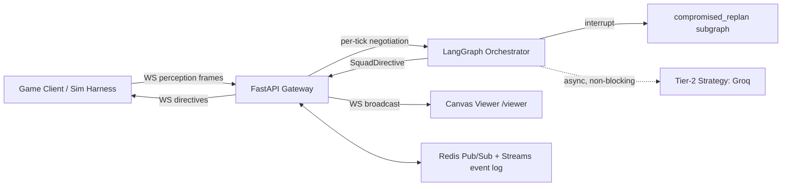
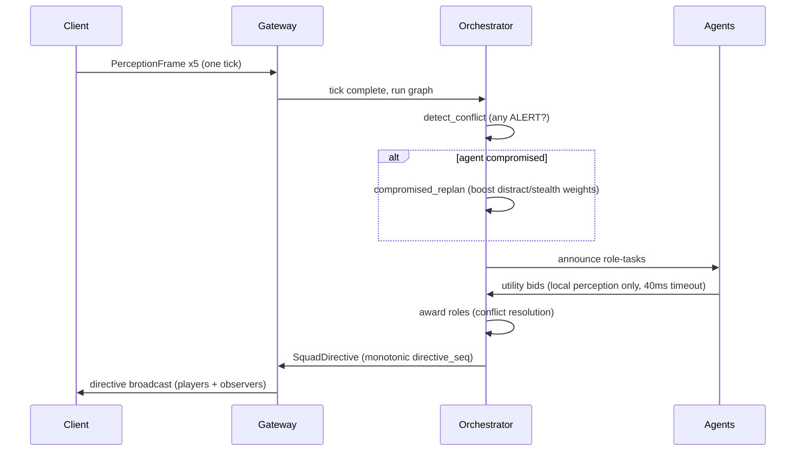

# TactixNet

> Decentralized multi-agent coordination engine for real-time tactics games — LangGraph-orchestrated squad negotiation over Redis, served through an async FastAPI gateway.

[](https://github.com/ankitpatil3003/TactixNet/actions/workflows/ci.yml)
[](https://www.python.org/downloads/)
[](https://github.com/ankitpatil3003/TactixNet/tags)
[](LICENSE)

## What is this?

TactixNet coordinates a squad of AI agents in a real-time tactics game. Think of a 5-agent stealth squad: one flanks, one distracts, one covers, one overwatches, one breaches. When a guard spots an agent mid-plan, the squad instantly re-negotiates roles — without a central controller and without waiting on an LLM.

The core idea is a **two-tier brain**:

| Tier | Latency | What it does |
|------|---------|--------------|
| **Tier 1 — Reflex** | p95 < 150 ms (measured: **0.15 ms**) | Deterministic utility scoring + Contract Net Protocol bidding. Resolves "guard spotted me → squad re-roles" instantly. Pure asyncio, no LLM in the loop. |
| **Tier 2 — Strategy** | 200 ms – 2 s, async | A LangGraph node calls Groq to generate squad *doctrine* (role weights, priorities, fallback plans) that Tier 1 consumes. Never blocks the game tick; degrades gracefully when the LLM is down. |

Agents are **decentralized**: each sees only its local perception (position, vision cone, alert level, ammo) plus broadcast intents — never global state. Roles are won by bidding, not assigned top-down.

## Architecture



### One negotiation cycle



## Live Demo

Four terminals (or three — Redis is optional for the local demo):

```bash
# 0. Install
pip install -r requirements.txt
cp .env.example .env          # set GROQ_API_KEY only if you want Tier-2

# 1. Gateway
uvicorn gateway.app:app --port 8000

# 2. Demo driver: 5-agent squad advances toward a patrolled objective at 10Hz
python -m simulation.run_demo --hz 10 --ticks 300
```

The driver prints the viewer URL, e.g.:

```
Squad 3f2a... created — streaming 300 ticks at 10.0Hz
Viewer: http://localhost:8000/viewer?squad=3f2a...
tick=1 seq=1 latency=1.2ms roles={'a1': 'flank', 'a2': 'distract', ...}
tick=42 seq=42 latency=1.4ms roles={...} [REPLAN]
```

**3. Open the viewer URL in a browser.** You'll see the squad advancing on the grid, guards with vision circles, agents color-coded by alert level (green → yellow → orange → red), awarded roles under each agent, and a HUD with tick / directive seq / negotiation latency / replan counter. When agents enter a guard's vision, the replan badge flashes and roles reshuffle live.

*(Screenshot/GIF: run the demo and capture the viewer — a 10–15 s clip of a replan cascade makes a great demo.)*

## Benchmarks

Full perceive → negotiate → commit on the reflex path, 5 agents, 10,000 ticks:

| Metric | Measured | Budget |
|--------|----------|--------|
| p50 | 0.14 ms | — |
| p95 | **0.15 ms** | < 150 ms |
| p99 | 0.16 ms | — |
| Max | 0.39 ms | — |

Reproduce: `python -m simulation.benchmark --ticks 10000` — writes [docs/benchmark-results.md](docs/benchmark-results.md) with environment info and a latency histogram. Methodology: [docs/benchmark-methodology.md](docs/benchmark-methodology.md).

## Project Structure

```
tactixnet/
├── contracts/     # Shared Pydantic v2 schemas (extra="forbid") — single source of truth
├── gateway/       # FastAPI: WS hot path, REST control plane, live negotiation runner, /viewer
├── engine/        # LangGraph StateGraph, Redis bus, checkpointer, CNP award logic
├── agents/        # Localized perception model, per-role utility functions, CNP bidder
├── simulation/    # Headless grid sim, YAML scenarios, demo driver, benchmark CLI
├── viewer/        # Canvas visualizer (served by the gateway at /viewer)
├── tests/         # Unit + integration (39 tests)
└── docs/          # Architecture, protocol, benchmark methodology + results
```

## API Reference

### REST

| Endpoint | Method | Description |
|----------|--------|-------------|
| `/health` | GET | Liveness check |
| `/squads` | POST | Create a squad session — `{"agent_ids": ["a1", ...]}` |
| `/squads/{id}` | GET | Squad state incl. `last_directive` |
| `/squads/{id}/doctrine` | POST | Update Tier-2 doctrine (role weights) |
| `/viewer` | GET | Canvas viewer page |

### WebSocket `/ws/squads/{id}`

**Send** (player mode) — one `PerceptionFrame` per agent per tick:

```json
{
  "agent_id": "a1",
  "tick": 42,
  "position": [3.5, 2.0],
  "heading": 90.0,
  "visibility_polygon": [[0,0],[1,0],[1,1]],
  "visible_entities": [{"entity_id": "g1", "entity_type": "guard", "position": [10,10], "threat_level": 0.7}],
  "alert_level": "SUSPICIOUS",
  "ammo": 30
}
```

**Receive** — a directive when the tick's negotiation commits:

```json
{
  "type": "directive",
  "directive": {
    "squad_id": "…", "directive_seq": 42, "tick": 42,
    "awards": [{"agent_id": "a1", "task_id": "…", "role": "flank", "utility": 0.9}],
    "objective_ref": "breach-alpha"
  },
  "latency_ms": 1.2,
  "interrupted": false,
  "replan_count": 0
}
```

Connect with `?mode=observer` to receive directives and `world_snapshot` relays without participating (used by the viewer). Malformed frames get a structured `{"type": "error", "code": "MALFORMED_FRAME", ...}` reply.

## Design Decisions

- **Why Contract Net Protocol?** It's a named, citable MAS negotiation protocol: tasks are announced, agents bid with locally-computed utility, highest bidder wins with conflict resolution. Decentralization falls out naturally — no agent needs global state to bid.
- **Why is the LLM outside the hot loop?** Even fast inference (~300 tok/s) can't reliably return structured output for 5 agents inside a 150 ms tick. So the LLM shapes *doctrine* (utility weights) asynchronously, and the deterministic reflex layer does the per-tick work. If Groq is down, `StrategyLayer` returns a fallback doctrine and the squad keeps fighting.
- **Interrupt-driven replanning:** an `ALERT`/`COMPROMISED` frame routes the graph through `compromised_replan`, which boosts distract/stealth weights and revises the objective before bidding. The chaos test injects an ALERT mid-cycle and asserts recovery with monotonic `directive_seq`.
- **Timeout as backpressure:** bids are gathered with a hard `asyncio.wait_for` deadline — a slow agent forfeits its bid rather than stalling the squad. Same policy at the tick level: an incomplete tick is flushed when a newer tick arrives.

## Environment

| Variable | Default | Description |
|----------|---------|-------------|
| `REDIS_URL` | `redis://localhost:6379/0` | Redis connection (event log / bus; optional for local demo) |
| `GROQ_API_KEY` | — | Enables Tier-2 strategy layer (optional) |
| `ENGINE_LOG_LEVEL` | `INFO` | Engine runner log level |

Get a Groq key at [console.groq.com](https://console.groq.com/keys).

## Development

```bash
# Tests + lint
pytest
ruff check .

# Full stack in Docker (redis + gateway + engine)
docker compose up
```

**Branching:** `main` (release) ← PR ← `develop` (integration) ← PR ← `feature/*`. Every change lands via PR; CI (ruff + pytest with a Redis service) runs on all PRs.

## Documentation

- [Architecture](docs/architecture.md) — two-tier brain, components, interrupt replanning
- [Protocol](docs/protocol.md) — CNP cycle, utility functions, timeout policy
- [Benchmark methodology](docs/benchmark-methodology.md) and [latest results](docs/benchmark-results.md)

## License

See [LICENSE](LICENSE).
