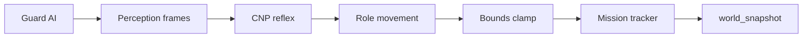

# Living Simulation

The headless grid simulator drives demos, benchmarks, and the Squad Console. It provides guards, squad movement, mission evaluation, and `world_snapshot` payloads for the canvas viewer.

## Tick loop

Each simulation tick:

1. **Guard AI** (`simulation/grid.py`) — patrol, investigate, or chase; positions clamped to grid bounds.
2. **Perception** — each agent receives a `PerceptionFrame` with localized guard visibility (directional vision arcs).
3. **Negotiation** — gateway/engine runs CNP reflex bidding (external to the sim harness).
4. **Role movement** (`simulation/movement.py`) — agents move by awarded role; positions clamped to grid bounds.
5. **Mission** (`simulation/mission.py`) — win/lose evaluation against scenario objectives.



## World bounds

`simulation/bounds.py` keeps entities inside the playable grid:

- `clamp_position(pos, width, height, margin=0.5)` — clamp to `[margin, width-margin]`
- `is_in_bounds(pos, width, height)` — used by soak tests

`build_sim()` reads `grid_size` from scenario YAML and passes `width`/`height` into `GridSim`. Both agent and guard positions are clamped after every movement update.

When `move_away()` would flee off-grid, movement blends toward the objective at a reduced step instead of trapping agents in corners.

## Guard AI

Guards use an interpolated patrol (no waypoint teleporting):

| State | Behavior |
|-------|----------|
| `patrol` | `move_toward` next patrol waypoint at `patrol_speed`; advance index on arrival |
| `investigate` | Move toward `last_seen_position` when sight is lost |
| `chase` | Pursue nearest visible agent when within ~55% of `vision_range` |

**Directional vision:** guards detect agents only inside a forward arc (`vision_angle_deg`, default 120°) based on movement `heading`. Agent perception uses the same model — rear approaches are harder to detect.

Per-guard YAML overrides (optional):

```yaml
guards:
  - id: g1
    position: [10, 10]
    vision_range: 3.5
    vision_angle_deg: 120
    patrol_speed: 0.2
    patrol:
      - [10, 10]
      - [12, 10]
```

## Squad role movement

`step_agent_by_role()` executes bounded tactical behaviors each tick:

| Role | Movement |
|------|----------|
| `breach` | Direct toward objective; slower under `ALERT+` |
| `flank` | Arc perpendicular to guard→objective line, biased toward objective |
| `distract` | Feint toward guard; orbit at `vision_range * 0.8`, never closer |
| `stealth-cover` | Move to cover point between squad centroid and guard, then creep toward objective |
| `overwatch` | Hold back from nearest guard while biasing toward objective corridor |

Movement updates `agent.heading` from the travel direction each tick. Squad centroid is used for cover/overwatch coordination.

## Scenario YAML

Scenarios live in `simulation/scenarios/*.yaml`.

| Field | Description |
|-------|-------------|
| `name` | Scenario identifier |
| `tick_rate_hz` | Demo/console tick rate |
| `squad_size` | Expected agent count (validated at load) |
| `grid_size` | Grid width/height (default 20) |
| `objective` | Mission label |
| `objective_position` | `[x, y]` win/hold zone center |
| `objective_radius` | Zone radius |
| `win_condition` | `reach_objective` or `hold_objective` |
| `hold_ticks` | Ticks to hold (hold scenarios) |
| `lose_on_all_compromised` | Mission loss when all agents compromised |
| `agents` | Spawn list: `id`, `position` |
| `guards` | Guard list: `id`, `position`, `patrol`, optional vision/patrol fields |
| `spawn_roles` | Optional map of `agent_id → role` for deterministic demo movement |

**Spawn guidelines:** keep agents ≥2 units from grid edges; stagger roles geographically (flankers wider, breach center-rear).

Built-in scenarios:

| File | Description |
|------|-------------|
| `default.yaml` | `breach-alpha` — 5 agents, 1 guard, reach objective |
| `ambush.yaml` | `extract-vip` — edge approach, 2 guards |
| `hold.yaml` | `hold-point` — 4 agents, hold beacon 25 ticks |

## Console world editor

From `/console`, select a squad to edit its persisted scenario before starting simulation:

| Control | API |
|---------|-----|
| Add/remove guards, patrol waypoints, vision range | `PATCH /squads/{id}/scenario` `{ "guards": [...] }` |
| Objective position / grid size | same endpoint |
| Reset to base YAML file | `PATCH` `{ "reset_to_file": true }` |
| Delete squad | `DELETE /squads/{id}` |

Custom guards are stored on the squad session and used by `stream_simulation()` via `resolve_scenario_for_squad()` (inline edits win over the on-disk file unless you override with a different scenario name on Start).

## world_snapshot

Relayed to observer WebSockets and replay. Shape produced by `simulation/driver.py`:

- Guards include optional `patrol` arrays for viewer route overlay.
- `spawn_roles` in scenario YAML are applied from tick 1 in `stream_simulation()` (before first directive).

```json
{
  "type": "world_snapshot",
  "tick": 42,
  "agents": [
    { "id": "a1", "position": [3.5, 4.0], "alert_level": "CALM" }
  ],
  "guards": [
    {
      "id": "g1",
      "position": [10.0, 10.0],
      "vision_range": 3.5,
      "vision_angle_deg": 120,
      "heading": 45.0,
      "state": "patrol",
      "patrol": [[10, 10], [12, 10], [12, 12]]
    }
  ],
  "mission": {
    "objective": "breach-gate",
    "status": "active",
    "agents_at_objective": 0
  }
}
```

The viewer draws guard vision arcs from `vision_range`, `vision_angle_deg`, and `heading`; patrol polylines from `patrol`; guard state badges show `patrol`, `investigate`, or `chase`.

`GET /squads/{id}/simulation` returns `reason`, `directives`, and `replans` after a console or API simulation run.

## Running simulations

**CLI demo:**

```bash
python -m simulation.run_demo --ticks 300
python -m simulation.run_demo --scenario simulation/scenarios/ambush.yaml --ticks 300
```

**Squad Console:** `http://localhost:8000/console` — create squad, apply doctrine, start simulation on demand.

**Programmatic:** `simulation/driver.py` exports `build_sim()`, `stream_simulation()`, and `world_snapshot()` for gateway `SimulationRunner`.

## Tests

| File | Coverage |
|------|----------|
| `tests/test_movement.py` | Bounds, per-role movement, 300-tick soak (default + ambush) |
| `tests/test_guard_ai.py` | Patrol interpolation, directional vision, chase/investigate |
| `tests/test_tactical_sim.py` | Grid size wiring, 5 distinct roles, mission reachability |
